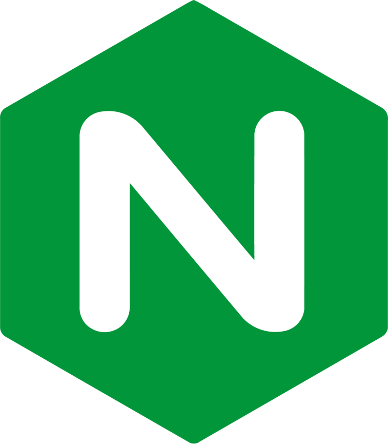
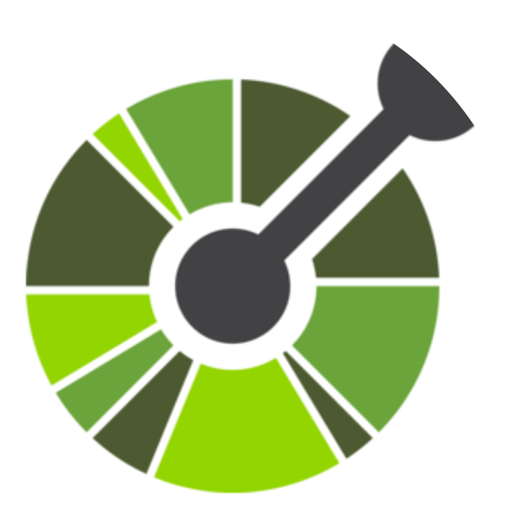
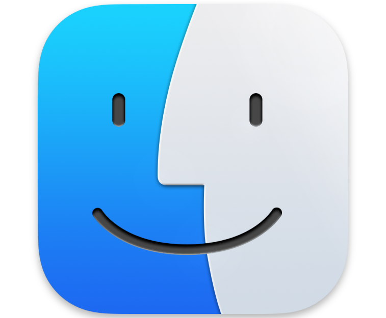
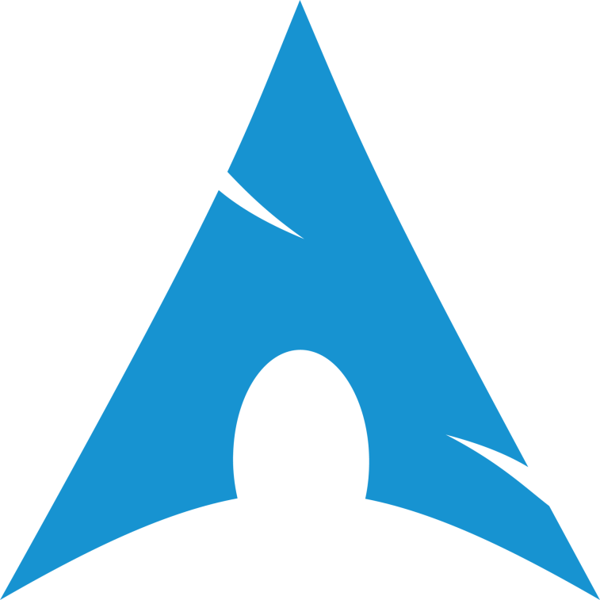

### Hi there 👋

I’m Catalin, a Software Developer passionate about building interactive, performant, and scalable web applications.
Highly motivated in designing user-friendly interfaces and writing clean, maintainable code with TypeScript. Hands-on
experience working with Next.js for server-side React applications and occasionally with Java and Spring Boot for
backend development. Solid full-stack experience across both frontend and backend, with a primary focus and passion for
building intuitive and engaging user interfaces. Skilled in leveraging Kubernetes and Docker for orchestration and
deployment.

### Currently working with:

**UI libraries:**

**IDEs & Tools:**

**Preferred operating systems:**

### Previously worked with:

<b>My Values</b>

- Clean, readable, and maintainable code
- Data-informed decision-making
- Continuous improvement and learning
- Collaboration & clear communication
- From refactoring code to fine-tuning interfaces, I enjoy polishing projects until they feel complete and intuitive

 

|  |  |
| ------------- | ------------- |

---

### Get in Touch

Feel free to connect with me or check out my projects here on GitHub. Let’s build something great!
